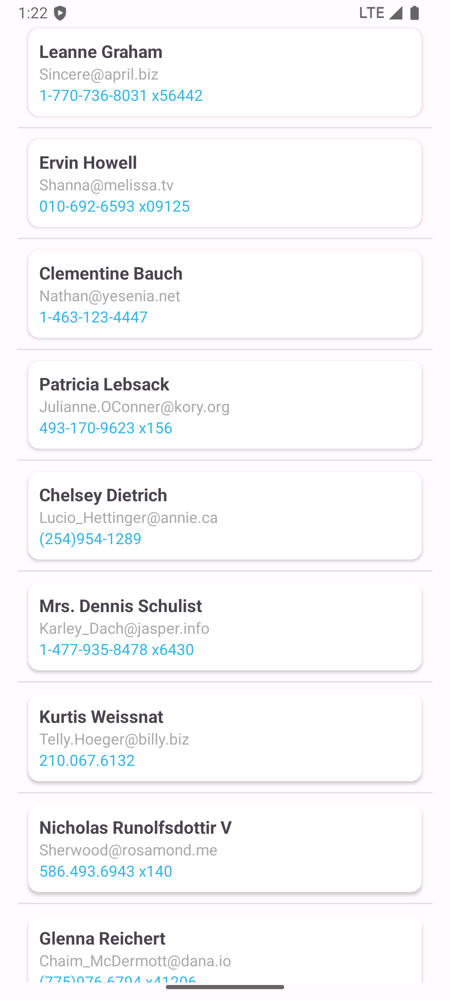

# Desenvolvimento de Aplicações para Dispostivos Móveis
## Atividade da aula do dia 26/05/2025
### Formas de consumir uma API
* REST (Representational State Transfer)
- Uma API rest oferece dados em formato JSON (javascript object notation), via requisições HTTP
* SOAP (Simple Object Access Protocol)
### Utilizaremos REST.
### Captura de Tela:
